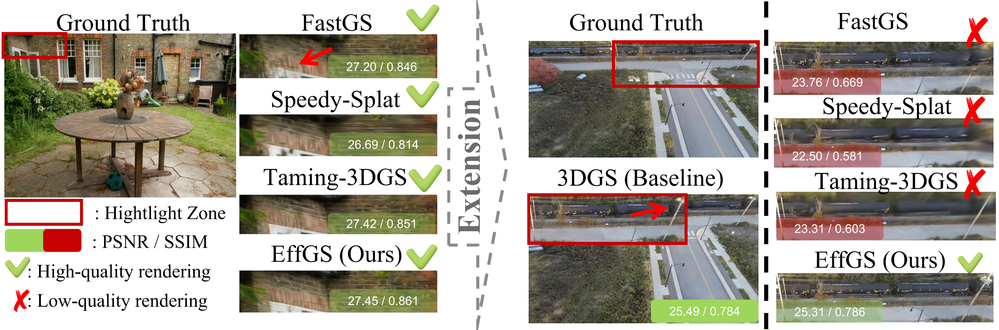
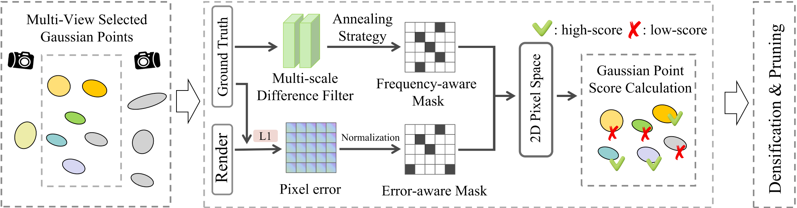

# EffGS: Efficient and High-Fidelity Gaussian Splatting

  <a href="PAPER_LINK"><strong>Paper</strong></a> |
  <a href="PROJECT_PAGE_LINK"><strong>Project Page</strong></a> 

  

## Overview

**EffGS** is an efficient and high-fidelity Gaussian Splatting framework designed
for both bounded and large-scale scene reconstruction.

EffGS improves the quality-efficiency trade-off of 3D Gaussian Splatting through:

- **Frequency-Aware Optimization**, which combines reconstruction errors with
  stage-dependent Difference-of-Gaussians guidance for primitive allocation and
  reconstruction supervision.
- **Localized Densification and Pruning (LDP)**, which restricts density control
  to Gaussians with valid projected footprints in the sampled views.
- **Adaptive Primitive Compactness**, which introduces learnable per-Gaussian
  scale modulation to adapt effective primitive support while retaining efficient
  Compact Box rasterization.

  

## Highlights

- 🚀 Efficient training across both bounded and city-scale scenes.
- 🎯 High-fidelity novel-view synthesis with improved reconstruction quality.
- 🌆 Scalable to large and complex urban scenes.
- 🔍 Frequency-aware guidance for detail-preserving Gaussian allocation.
- 📍 View-localized densification and pruning.
- 📦 Learnable primitive compactness for improved quality-efficiency trade-offs.

## News

- **[2026-10-01]** Paper released, Code coming soon.

